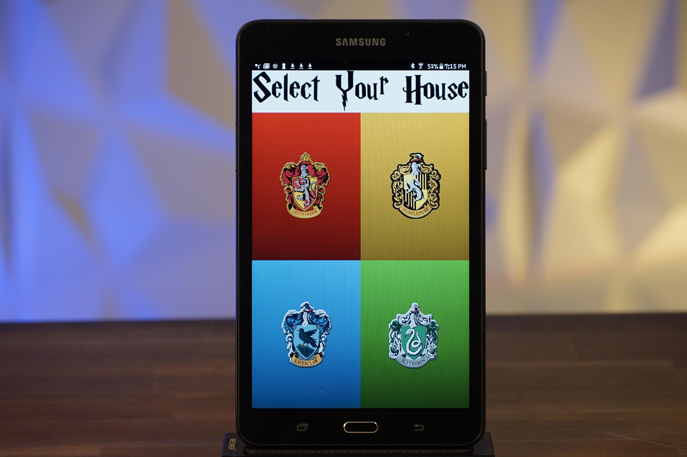

# Wizard-Chess

  
  

Wizard Chess is a form of chess originally invented by J.K. Rowling in Harry Potter and the Sorcerer's Stone. The characters give verbal commands to the chess pieces and they move by magic. Seems impossible right? Not anymore! Using an Arduino Uno, along with an XY plotter, Wizard Chess can be recreated in real life! You can now play a full game of chess using voice commands and the chess pieces will automatically react accordingly. Code was written in Arduino C to be able to parse incoming Serial data from the HC-05 bluetooth module and translate that information to instructions on how to move each stepper motor. The code detects false moves at an elementary level by preventing users from making illegal moves (ie. moving a Rook in a diagonal manner). However, advanced moves such as castling or en passants are not accounted for. 

  
  

A custom and intutitive user interface was created to allow users to choose their hour, connect to the Chess Board and be able to send verbal commands. Using MIT App Inventor, various features were used to ensure smooth functionailty of the application. Bluetooth functionality was added to upport bi-directional communicaiton between the Android tablet and the HC-05 bluetooth module on the Arduino. A Google Speech Recognizer was implemented to be able to retrieve verbal input and send that data to the Arduino to parse and translate to movement. A database was used to keep track of variables for the Wizarding Houses to function properly as MIT App Inventor does not natively support this feature. Finally, the Harry Potter Theme (Hedwig's Theme) was implemented in which users can let the music play in the background. 

For more information and videos visit the [Instructables](https://www.instructables.com/Wizard-Chess/) which documents the procedure and more! 

Feel free to connect with me on any of the following platforms to talk about question, possible collaborations, opportunities, events, tech, or for fun!! Can't wait to meet you!

  

  

  

  

 
